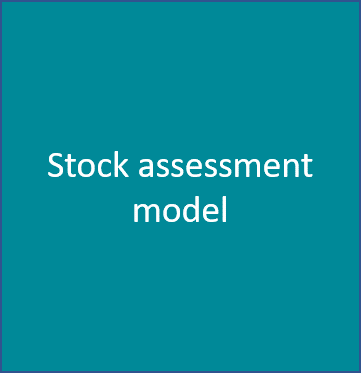
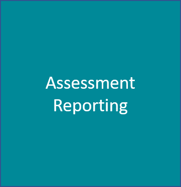

layout: true

.footnote[U.S. Department of Commerce | National Oceanic and Atmospheric Administration | National Marine Fisheries Service]


```{r setup, include=FALSE}
options(htmltools.dir.version = FALSE)
```

```{r xaringan-tile-view, echo=FALSE}
# this gives you a tile navigation if you type "O" at any time
xaringanExtra::use_tile_view()
```

---

# Notes

The template and css makes a presentation that has a few tweaks in `slides-style.css`.  `slide-style.css` is adapted from An RStudio workshop on data science [design-ds-classroom](https://github.com/rstudio-conf-2020/design-ds-classroom) by [Mine Cetinkaya-Rundel](https://github.com/mine-cetinkaya-rundel). 

* I have tweaked the title slide css in `slides-style.css` and needed to remove `date:` from the yaml.
* `slides-style.css` has a number of extra customizations such as square for the bullets, some colored boxes, and a wide left column class.
* Instead of page numbers, there is a progress bar across the top.
* You may want to futz with the css for the title at the top of `slides-style.css`
* To add a Table of Contents, I wrote a helper function `render_toc.R` and add `name:` and `text:` to each slide. `name` should have no spaces. `text` is what you want to show for the TOC. If you leave off `text:`, it will use `name`. If you leave off `name`, the slide won't appear int he TOC.
* I am using `https://github.com/gadenbuie/xaringanExtra` to have the tile navigation.

---

```{r setup-toc, include=FALSE} 
knitr::opts_chunk$set(echo = TRUE)
source('assets/render_toc.R')
```

## Table of Contents

<!---
At any time, you can press "O" (capital O) and see tiles of the slides that you can jump   between.
--->

```{r toc, echo=FALSE, class="flexcolumn"} 
render_toc("SAR_workflows_NSASS.Rmd")
```


---
name: summary
text: Stock Assessment Workflows

## Stock Assessment Workflows

What are they?

> * Process of evaluating a fisheries population from gathering input data, running an assessment model, writing a report, and presenting to a managing body
> * Composed of three parts

.three-column[

]

.three-column[

]

.three-column[

]


---
## Stock Assessment Workflows

How can they vary?

- Regionally different (even species to species)
- Simple to more complex
- Partially automated or manual

---
name: variation
text: Regional Variation

## Regional Variation


---
name: objectives
text: Objectives

## Objectives

- Improve stock assessment process by developing a reproducible and streamlined workflow
- Ensure the end product supports production of stock assessments
- Integrates into the next generation of assessment modelling

---
class: middle

# Example

---
name: asar-example
text: ASAR Example

## ASAR R Package and Template

.pull-left[
- Run function
- Create template with modular design of quarto files to better break down the report

```
asar::create_template(
  new_template = TRUE,
  format = "pdf",
  office = "NWFSC",
  species = "Dover sole",
  spp_latin = "Pomatomus saltatrix",
  year = 2010,
  author = c("John Snow", "Danny Phantom", "Patrick Star"),
  include_affiliation = TRUE,
  parameters = FALSE,
  resdir = "C:/Users/Documents/Example_Files",
  model_results = "Report.sso",
  model = "SS3"
)
```
]
.pull-right[


]

---
## ASAR R Package and Template

.pull-left[

]
.pull-right[

]

---
name: asar-satf
text: Pre-programmed Tables and Figures

## Pre-Programmed Tables and Figures

.pull-left[
- Packaged into satf
- Pre-coded tables (flextable) and figures (ggplot2)
- Designed to work with standard file format that is made through converter function
  - Works with stock synthesis and BAM output files
  - WHAM and AMAK up next
]
.pull-right[

]

---
name: sidemargins
text: Side margins

## Side margin


.pull-left-wide[
The side margin is not limited to text.

- Figures
- References
- Images

Everything will get scaled to fit.
]
.pull-right-narrow[
.hand-blue[
```{r}
plot(1:10)
```


]
]

---
name: Footnotes


# Footnotes

Because the NMFS footnote is already occupying the footnote space, you need to add some linefeeds to move the footnote upward. 


- some content
- a [link](http://www.google.com)


```{r}
r <- 2 + 2
```

.footnote[It is quite finicky. Add a linefeed and it breaks.<br><br>]


---
name: Boxes

# Boxes

.bluebox[## Blue box
- The ## header will appear at the top in grey
- Or leave it off and add different text or header
]

.orangebox[## Orange box
```{r fig.height=2, echo=FALSE, fig.align='center'}
plot(1:100)
```
]

.yellowbox[## Yellow box
A note.
]

---
name: boxside
text: Boxes with side note


# Boxes and side notes

.pull-left-wide[
.orangebox[## Orange box
```{r fig.height=2, echo=FALSE, fig.align='center'}
plot(1:100)
```
]
]

.pull-right-narrow[
.hand-blue[
You can add sidenotes. Here I have wrapped the text in `.hand-blue` to make it smaller and blue.
]

.small[`.small` also works but the text is different. You can change this in the css. Note you need a linefeed in the side note code.
]

.small[If you leave off the line-feed, then it will use a span element and won't pick up the right line-height spacing.]]

---
name: twocolumn
text: Two columns


## Two column format

.pull-left[
- **ggplot2** is tidyverse's data visualization package
- The `gg` in "ggplot2" stands for Grammar of Graphics
- It is inspired by the book **Grammar of Graphics** by Leland Wilkinson
]
.pull-right[
- **ggplot2** is tidyverse's data visualization package
- The `gg` in "ggplot2" stands for Grammar of Graphics
- It is inspired by the book **Grammar of Graphics** by Leland Wilkinson
]

---
name: threecolumn
text: Three columns


## Three column format

.three-column[
Column 1

You can have code.

```{r}
lm(mpg ~ hp, data=mtcars)
```
]

.three-column[
Column 2

You can have images and embed video.


<iframe width="200" height="130" src="https://www.youtube.com/embed/BCMjVc9ncFo" title="YouTube video player" frameborder="0" allow="accelerometer; autoplay; clipboard-write; encrypted-media; gyroscope; picture-in-picture" allowfullscreen></iframe>
]

.three-column[
Column 3

&#127758; January 25, 2022 

&#127767; 09:00 - 17:00  

&#127881;    [rverse](http://rverse-tutorials.github.io)

]


---
name: full
text: Plot fills the slide


class: full
background-image: url("")
background-color: white

```{r, fig.asp = 3/4, fig.align = 'center', echo = FALSE, out.width = "96%", dpi= 300, warning = FALSE}
library(ggplot2)

ggplot(mtcars) +
  aes(mpg, hp,
      color = cyl) +
  geom_point() +
  theme_minimal() +
  labs(title = "mpg vs hp")
```